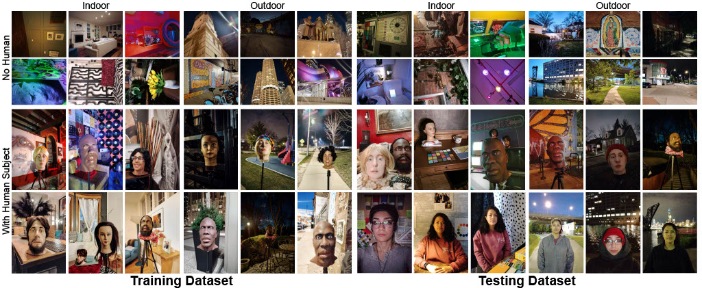

[![CC BY-NC 4.0][cc-by-nc-shield]][cc-by-nc]

# LENVIZ

[Paper](https://arxiv.org/abs/2503.19804)

Official Repo for the Low Exposure Night Vision (LENVIZ) Dataset, a comprehensive multi-exposure benchmark dataset for low-light image enhancement comprising of over 230K frames showcasing 24K real-world indoor and outdoor, with-and-without human, scenes.



## Dataset access
Download link: to be added

## License

This work is licensed under a
[Creative Commons Attribution-NonCommercial 4.0 International License][cc-by-nc].

[![CC BY-NC 4.0][cc-by-nc-image]][cc-by-nc]

[cc-by-nc]: https://creativecommons.org/licenses/by-nc/4.0/
[cc-by-nc-image]: https://licensebuttons.net/l/by-nc/4.0/88x31.png
[cc-by-nc-shield]: https://img.shields.io/badge/License-CC%20BY--NC%204.0-lightgrey.svg

## Bibtex
```
@article{aithal2025lenvizhighresolutionlowexposurenight,
      title={LENVIZ: A High-Resolution Low-Exposure Night Vision Benchmark Dataset}, 
      author={Manjushree Aithal and Rosaura G. VidalMata and Manikandtan Kartha and Gong Chen and Eashan Adhikarla and Lucas N. Kirsten and Zhicheng Fu and Nikhil A. Madhusudhana and Joe Nasti},
      year={2025},
      archivePrefix={WACV},
      year={2025},
}
```
