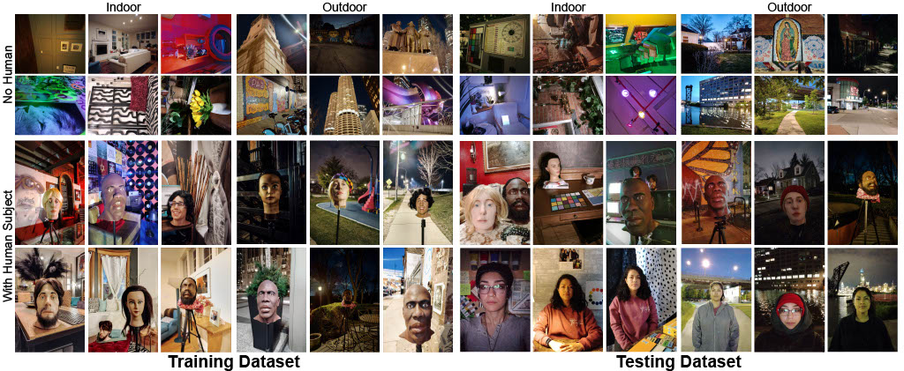

[![CC BY-NC 4.0][cc-by-nc-shield]][cc-by-nc]

# LENVIZ
[](https://arxiv.org/abs/2503.19804)

Official Repo for the Low Exposure Night Vision (LENVIZ) Dataset, a comprehensive multi-exposure benchmark dataset for low-light image enhancement comprising of over 230K frames showcasing 24K real-world indoor and outdoor, with-and-without human, scenes.



## Data Overview
LENVIZ is a comprehensive multi-exposure benchmark dataset for low-light image enhancement. Traditional imaging systems struggle in low-illumination environments due to their limited dynamic range, increased noise, and reduced signal-to-noise ratios. To advance research in this field, this dataset provides over 230K frames showcasing 24K real-world indoor and outdoor scenes.

## Key Features of the Dataset
1. **Massive Scale and High Resolution**: The dataset comprises 234,688 total frames, making it the largest publicly available up-to 4K resolution benchmark in the field.
2. **Multi-Exposure Flexibility**: Each scene includes 9 distinct exposure frames alongside a long-exposure shot.
3. **Expert-Curated Ground Truth**: High-quality ground truth images are provided for 13,067 scenes. These were meticulously edited by a team of 7 expert photographers focusing on technical quality, including brightness, contrast, and noise reduction.
4. **ISP-Tuned Raw Data Simulation**: LENVIZ provides JPEG images that are exclusively ISP-tuned, devoid of any default camera post-processing. This captures the inherent noise, over-exposure, and artifacts characteristic of low-light conditions.
5. **Diverse Content and Subjects**: The dataset incorporates 14 mannequins spanning a diverse range of skin tones and facial features. Overall, 70% of the scenes contain one or more faces.

## Dataset Composition
1. **Training Dataset**: Captured using three distinct camera modules (S5K4H7YX03-FGX9, S5KJN1SQ03, and S5KJNS) to broaden representativeness.
2. **Testing Dataset**: A curated set of 1,468 frames from 203 unique scenes. It is divided into a "Reference" partition, which includes 60 scenes with paired human-edited ground truth, and a "No-reference" partition, which includes 143 scenes with handheld captures and human subjects.

## Benchmarked Models
The dataset was utilized to conduct an in-depth evaluation of current state-of-the-art low-light image enhancement techniques.
1. **Single Exposure Methods**: Evaluated models include LLFormer, ExpoMamba, and ZeroDCE++.
2. **Multi-Exposure Methods**: Evaluated models include MEFNet, HoLoCo, and MobileMEF.
3. **Performance**: Models trained on LENVIZ consistently achieved superior scores in perceptual metrics like LPIPS and SSIM, demonstrating the dataset is highly effective at training models to produce visually pleasing and structurally sound results.

## LENVIZ Explanation
https://youtu.be/pDq2XlAdmZE

## Terms of Use & Data License Agreement

This work is licensed under a
[Creative Commons Attribution-NonCommercial 4.0 International License][cc-by-nc] 

[![CC BY-NC 4.0][cc-by-nc-image]][cc-by-nc]

[cc-by-nc]: https://creativecommons.org/licenses/by-nc/4.0/
[cc-by-nc-image]: https://licensebuttons.net/l/by-nc/4.0/88x31.png
[cc-by-nc-shield]: https://img.shields.io/badge/License-CC%20BY--NC%204.0-lightgrey.svg

## Dataset access
Download link: [Access request](https://forms.gle/pVzCPtSGi91VZmGT8)

By requesting and receiving access to the LENVIZ dataset, the Applicant (hereafter "User") agrees to the following [Terms of Use & Data License Agreement](https://github.com/rosauravidal/LENVIZ/blob/main/Data_Use_Agreement.md) 

## Bibtex
```
@article{aithal2025lenvizhighresolutionlowexposurenight,
      title={LENVIZ: A High-Resolution Low-Exposure Night Vision Benchmark Dataset}, 
      author={Manjushree Aithal and Rosaura G. VidalMata and Manikandtan Kartha and Gong Chen and Eashan Adhikarla and Lucas N. Kirsten and Zhicheng Fu and Nikhil A. Madhusudhana and Joe Nasti},
      year={2025},
      archivePrefix={WACV},
      year={2025},
}
```
